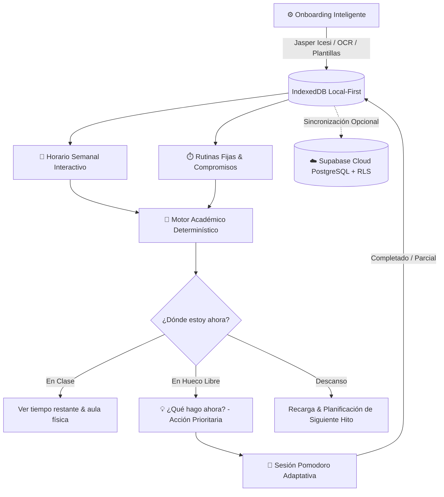

<div align="center">


# Mi Semestre · Sistema Operativo Personal del Semestre

**Centro de Control Académico Inteligente y Toma de Decisiones en Tiempo Real**  
*Diseñado a medida para la vida universitaria en la Universidad Icesi.*

[-black?style=for-the-badge&logo=next.js)](https://nextjs.org/)
[](https://react.dev/)
[](https://www.typescriptlang.org/)
[](https://pnpm.io/)
[-00A86B?style=for-the-badge)](https://dexie.org/)
[-3ECF8E?style=for-the-badge&logo=supabase)](https://supabase.com/)
[-16a34a?style=for-the-badge&logo=shield)](file:///Users/leonfeliperodriguez/Desktop/Trabajos/Horario/cyber-neo-report.md)
[](LICENSE)

<br/>


</div>

---

## 1. La Tesis del Producto: ¿Por qué no es otro horario?

Un estudiante universitario común tiene su vida académica fracturada en múltiples islas de información:
* **Horario de clases:** Portal de registro o Banner.
* **Entregas y tareas:** Moodle, Canvas, Teams y carpetas de Drive.
* **Fechas de exámenes:** Sílabos en PDF y mensajes dispersos en WhatsApp.
* **Notas y progreso:** Sistema académico oficial (Jasper / SIAG).
* **Tiempo libre real:** **Nadie lo calcula.**

La pregunta crítica del estudiante nunca es *«¿A qué hora tengo clase?»*, sino:

> **«Tengo 5 materias, parciales en 4 días, 3 talleres pendientes y un hueco de 1h 40m en el campus. ¿Me alcanza el tiempo? ¿Qué debería priorizar ahora mismo para no colapsar el fin de semana?»**

**Mi Semestre** transforma el horario estático en un **Sistema Operativo de Decisión**: descuenta tiempos de traslado, rutinas de almuerzo y margen cognitivo, cruzando las horas libres reales con la urgencia causal de parciales y entregas para recomendar la mejor acción inmediata.

---

## 2. Flujo Completo de Decisión (Decision Loop)



---

## 3. Características Principales

### 3.1. Asistente de Configuración Inicial (Onboarding Inteligente)
* **Ingesta Oficial Jasper / Banner de Icesi:** Extrae de forma automática perfil del estudiante (`Luis Ernesto Rodríguez Gurrute`), código (`A00414805`), programa (`Ingeniería Industrial`), GPA histórico (`4.3`), y carga todas las materias activas (`CFT 11373`, `CFT 11370`, `IND 05359`, `CFT 11356`, `IND 05358`) con horarios y aulas.
* **Reconocimiento Óptico (OCR de Imágenes):** Permite arrastrar capturas de pantalla de horarios (`.png`, `.jpg`, `.webp`) procesadas localmente.
* **Catálogo de Plantillas Oficiales Icesi:** Programas calibrados listos para usar en un clic (Ingeniería Industrial, Sistemas, Administración y Medicina).
* **Creador Paso a Paso:** Wizard manual para estructurar el semestre desde cero.

### 3.2. Horario Semanal Interactivo & Rutinas Fijas
* Edición integral en vivo: nombre de materia, código NRC, profesor, color distintivo, límite de inasistencias y salón físico.
* Bloques de tiempo fijos para compromisos cotidianos: **almuerzo, gimnasio, traslados y trabajo**.
* Control de inasistencias por clase con radar preventivo de pérdida de materia por faltas.

### 3.3. Motor Académico Determinístico Puro
* **Cálculo de Huecos Libres (`calculateFreeSlots`):** Divide los espacios entre clases descontando tiempos de traslado y margen personal.
* **Radar de Riesgo Causal (`calculateRisk`):** Analiza notas acumuladas, peso del próximo examen, faltas restantes y proximidad de entregas.
* **Detección de Conflictos (`detectConflicts`):** Previene solapamientos de clases o actividades fijas.

### 3.4. Sincronización en la Nube con Supabase (PostgreSQL + RLS)
* Arquitectura **Local-First**: Operatividad 100% offline garantizada en el navegador con Dexie.js.
* Respaldo y restauración en la nube con Supabase Auth y PostgreSQL.
* Seguridad garantizada mediante **Row Level Security (RLS)**: Cada estudiante solo puede leer y modificar sus propios datos mediante `auth.uid()`.

---

## 4. Auditoría de Ciberseguridad (Cyber Neo & OWASP 2025)

El proyecto fue auditado exhaustivamente bajo el estándar **OWASP 2025 Top 10** y **CWE Top 25** mediante el motor de seguridad Cyber Neo:

| Parámetro | Resultado | Estado |
|---|---|---|
| **Puntuación de Riesgo** | **9 / 100** | **Riesgo Bajo (Low Risk)** |
| **Vulnerabilidades SCA (CVEs)** | **0 detectadas** en 484 dependencias | Limpio |
| **Integridad de Lockfile** | Consistente con `pnpm-lock.yaml` | Verificado |
| **Filtración de Credenciales** | 0 claves privadas en historial Git (`.env` protegido) | Conforme |
| **Cabeceras HTTP de Seguridad** | HSTS, X-Frame-Options: DENY, nosniff, CSP | Configurado |
| **Protección en Base de Datos** | Políticas RLS estrictas en todas las tablas | Conforme |

El informe completo de seguridad se encuentra disponible en:  
📄 [cyber-neo-report.md](cyber-neo-report.md)

---

## 5. Arquitectura del Repositorio

```text
.
├── public/                               # Assets estáticos, logos WebP y banner institucional
├── src/
│   ├── app/                              # Next.js 16 App Router (Rutas Estáticas Prerenderizadas)
│   │   ├── balance/page.tsx              # Balance académico oficial y avance de carrera
│   │   ├── dashboard/page.tsx            # Centro de decisión: "¿Qué hago ahora?"
│   │   ├── schedule/page.tsx             # Horario semanal y bloques de tiempo
│   │   ├── tasks/page.tsx                # Entregas con estimación de esfuerzo
│   │   ├── exams/page.tsx                # Parciales con ponderación porcentual
│   │   ├── radar/page.tsx                # Radar de riesgo explicable por materia
│   │   ├── timeline/page.tsx             # Línea temporal de 16 semanas
│   │   ├── globals.css                   # Design Tokens CAMBAS+ (Modo Claro & Oscuro)
│   │   └── layout.tsx                    # Shell del sistema y modales diferidos
│   │
│   ├── components/
│   │   ├── dashboard/                    # NowActionCard, DecisionHeroCard, Widgets
│   │   ├── layout/                       # Sidebar institucional, TopHeader, MobileNav
│   │   ├── modals/
│   │   │   └── GlobalModals.tsx          # Carga diferida dinámica de los 9 modales (Client Component)
│   │   ├── schedule/SmartTimetable.tsx   # Rejilla horaria interactiva con rutinas y clases
│   │   └── radar/RiskCard.tsx            # Visualización cuantitativa del riesgo académico
│   │
│   ├── hooks/
│   │   └── useSemesterData.ts            # Hook de sincronización local reactiva con Dexie
│   │
│   ├── lib/
│   │   ├── academic-engine/              # Lógica de cálculo pura sin dependencias de UI
│   │   ├── importer/                     # Parser Jasper Icesi y OCR de horarios
│   │   ├── storage/                      # Repositorios tipados en IndexedDB (Dexie.js)
│   │   └── supabase/                     # Cliente singleton y servicio de sincronización cloud
│   │
│   ├── stores/                           # Estado UI global con Zustand
│   └── tests/                            # Suites de pruebas unitarias (Engine + Ingester)
│
├── supabase/
│   └── schema.sql                        # Esquema PostgreSQL, tablas e índices RLS
├── pnpm-lock.yaml                        # Lockfile determinístico de pnpm
└── next.config.ts                        # Cabeceras de seguridad HTTP y optimizaciones Next.js
```

---

## 6. Instalación y Puesta en Marcha

### Prerrequisitos
* **Node.js 20+**
* **pnpm 11+** (Recomendado) o npm

### Pasos de Instalación

1. **Clonar el repositorio:**
   ```bash
   git clone https://github.com/luisrodriguez-rgb/Mi-Semestre.git
   cd Mi-Semestre
   ```

2. **Instalar dependencias con pnpm:**
   ```bash
   pnpm install
   ```

3. **Configurar variables de entorno:**
   Copia la plantilla `.env.example`:
   ```bash
   cp .env.example .env
   ```
   Agrega tus credenciales de Supabase (opcional para sincronización en la nube):
   ```env
   NEXT_PUBLIC_SUPABASE_URL=https://tu-proyecto.supabase.co
   NEXT_PUBLIC_SUPABASE_ANON_KEY=tu-clave-anonima-publica
   ```

4. **Iniciar el servidor de desarrollo:**
   ```bash
   pnpm dev
   ```
   Abre [http://localhost:3000](http://localhost:3000) en tu navegador.

5. **Ejecutar la suite de pruebas automatizadas:**
   ```bash
   pnpm test
   ```

6. **Compilar para producción:**
   ```bash
   pnpm run build
   ```

---

## 7. Scripts Disponibles

| Comando | Descripción |
| :--- | :--- |
| `pnpm dev` | Inicia el entorno de desarrollo con Fast Refresh y Webpack. |
| `pnpm test` | Ejecuta las pruebas del motor académico y del ingestor inteligente. |
| `pnpm run build` | Compila y optimiza la aplicación para producción (Rutas estáticas). |
| `pnpm run start` | Inicia el servidor optimizado de producción. |
| `pnpm run lint` | Ejecuta ESLint verificando buenas prácticas y tipado. |

---

## 8. Despliegue en Producción

El proyecto está preparado para despliegue instantáneo en **Vercel** o cualquier infraestructura compatible con Next.js:

1. Importar el repositorio en el panel de Vercel.
2. Configurar el Framework Preset como **Next.js**.
3. En la sección **Environment Variables**, añadir:
   * `NEXT_PUBLIC_SUPABASE_URL`
   * `NEXT_PUBLIC_SUPABASE_ANON_KEY`
4. Ejecutar `Deploy`.

*URL de producción oficial:* **[https://mi-semestre-ten.vercel.app/](https://mi-semestre-ten.vercel.app/)**

---

## Licencia

Distribuido bajo la Licencia MIT. Consulta el archivo `LICENSE` para más información.
